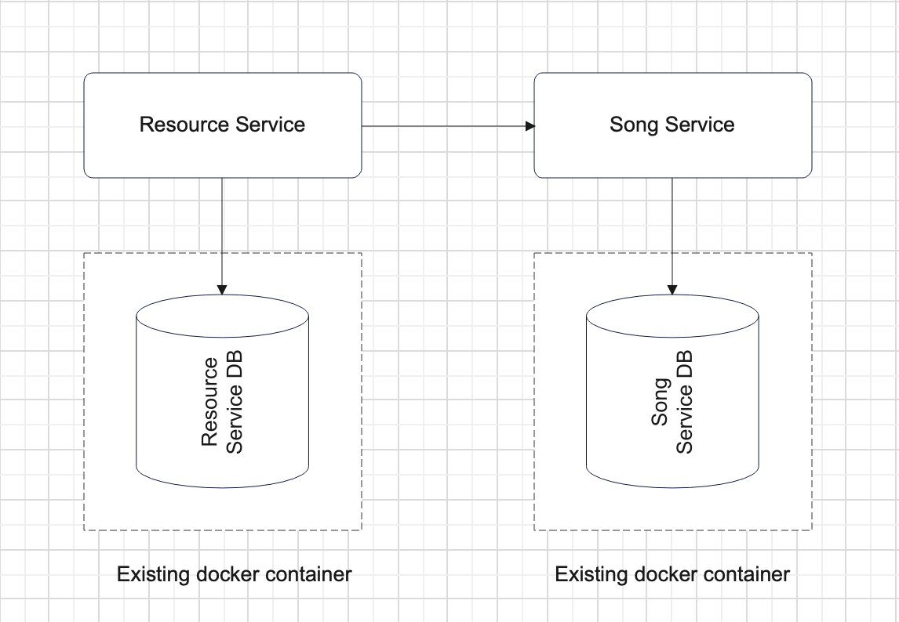

# Table of Content

- [What to do #1](#what-to-do-1)
- [Sub-task 1: Resource Service](#sub-task-1-resource-service)
- [Sub-task 2: Song Service](#sub-task-2-song-service)
- [What to do #2](#what-to-do-2)
- [Sub-task 3: Docker images](#sub-task-3-docker-images)
- [Sub-task 4: Docker Compose file](#sub-task-4-docker-compose-file)

## What to do #1

In this module you will need to create base structure of microservices system.
During this task you need to implement the next two services:

- **Resource Service**
- **Song Service**

## Sub-task 1: Resource Service

For a **Resource Service**, it is recommended to implement a service with CRUD operations for processing mp3 files.

**Service definition could be next:**

<table>
    <tr>
        <td><b>POST /resources</b></td>
        <td colspan="6"><b>Upload new resource</b></td>
    </tr>
    <tr>
        <td rowspan="2"><b>Request</b></td>
        <td><i>Parameter</i></td>
        <td><i>Description</i></td>
        <td><i>Restriction</i></td>
        <td><i>Body example</i></td>
        <td><i>Description</i></td>
        <td><i>Restriction</i></td>
    </tr>
    <tr>
        <td></td>
        <td></td>
        <td></td>
        <td>Audio data binary</td>
        <td>Content type – audio/mpeg</td>
        <td>MP3 audio data</td>
    </tr>
    <tr>
        <td rowspan="2"><b>Response</b></td>
        <td><i>Body</i></td>
        <td><i>Description</i></td>
        <td colspan="4"><i>Code</i></td>
    </tr>
    <tr>
        <td>
{

            
&nbsp;&nbsp;&nbsp;&nbsp;"id":1123

            
}

        </td>
        <td>Integer id — ID of the created resource</td>
        <td colspan="4">
200 – OK

                        
400 – Validation failed or request body is invalid MP3

                        
500 – An internal server error has occurred

        </td>
    </tr>
    <tr>
        <td><b>GET /resources/{id}</b></td>
        <td colspan="6"><b>Get the binary audio data of a resource</b></td>
    </tr>
    <tr>
        <td rowspan="3"><b>Request</b></td>
        <td><i>Parameter</i></td>
        <td><i>Description</i></td>
        <td><i>Restriction</i></td>
        <td><i>Body example</i></td>
        <td><i>Description</i></td>
        <td><i>Restriction</i></td>
    </tr>
    <tr>
        <td>Integer id</td>
        <td>The ID of the resource to get</td>
        <td>ID of an existing resource</td>
        <td></td>
        <td></td>
        <td></td>
    </tr>
    <tr>
    </tr>
    <tr>
        <td rowspan="2"><b>Response</b></td>
        <td><i>Body</i></td>
        <td><i>Description</i></td>
        <td colspan="4"><i>Code</i></td>
    </tr>
    <tr>
        <td>Audio bytes</td>
        <td></td>
        <td colspan="4">
200 – OK

                        
404 – The resource with the specified id does not exist

                        
500 – An internal server error has occurred

        </td>
    </tr>
    <tr>
        <td><b>DELETE /resources?id=1,2</b></td>
        <td colspan="6"><b>Delete a resource(s). If there is no resource for id, do nothing</b></td>
    </tr>
    <tr>
        <td rowspan="2"><b>Request</b></td>
        <td><i>Parameter</i></td>
        <td><i>Description</i></td>
        <td><i>Restriction</i></td>
        <td><i>Body example</i></td>
        <td><i>Description</i></td>
        <td><i>Restriction</i></td>
    </tr>
    <tr>
        <td>String id</td>
        <td>CSV (Comma Separated Values) of resource IDs to remove</td>
        <td>Valid CSV length < 200 characters</td>
        <td></td>
        <td></td>
        <td></td>
    </tr>
    <tr>
        <td rowspan="2"><b>Response</b></td>
        <td><i>Body</i></td>
        <td><i>Description</i></td>
        <td colspan="4"><i>Code</i></td>
    </tr>
    <tr>
        <td>
{

            
&nbsp;&nbsp;&nbsp;&nbsp;"ids": [1,2]

            
}

        </td>
        <td>Integer [] ids – ids of deleted resources</td>
        <td colspan="4">
200 – OK

                        
500 – An internal server error has occurred

        </td>
    </tr>
</table>

When uploading a mp3 file, the **Resource Service** should process the file in this way:
- Extract file metadata. An external library can be used for this purpose.(e.g. [Apache Tika](https://www.tutorialspoint.com/tika/tika_extracting_mp3_files.htm)).
- Store mp3 file to the underlying database of the service as Blob.
- Invoke **Song Service** to save mp3 file metadata.

## Sub-task 2: Song Service

For the **Song Service**, it is recommended to implement a simple CRUD service to manage the song record (metadata).
The service should provide the ability to manage some metadata about the songs (artist, album, etc.).
Make sure the service is still available over HTTP.

**Service definition could be next:**

<table>
    <tr>
        <td><b>POST /songs</b></td>
        <td colspan="6"><b>Create a new song metadata record in database</b></td>
    </tr>
    <tr>
        <td rowspan="2"><b>Request</b></td>
        <td><i>Parameter</i></td>
        <td><i>Description</i></td>
        <td colspan="2"><i>Body example</i></td>
        <td><i>Description</i></td>
        <td><i>Restriction</i></td>
    </tr>
    <tr>
        <td></td>
        <td></td>
        <td colspan="2">
{

            
&nbsp;&nbsp;&nbsp;&nbsp;"name": "We are the champions",

            
&nbsp;&nbsp;&nbsp;&nbsp;"artist": "Queen",

            
&nbsp;&nbsp;&nbsp;&nbsp;"album": "News of the world",

            
&nbsp;&nbsp;&nbsp;&nbsp;"length": "2:59",

            
&nbsp;&nbsp;&nbsp;&nbsp;"resourceId": "123",

            
&nbsp;&nbsp;&nbsp;&nbsp;"year": ""1977

            
}

        </td>
        <td>Song metadata record, referencing to resource id (mp3 file itself)</td>
        <td>MP3 audio data</td>
    </tr>
    <tr>
        <td rowspan="2"><b>Response</b></td>
        <td><i>Body</i></td>
        <td><i>Description</i></td>
        <td colspan="4"><i>Code</i></td>
    </tr>
    <tr>
        <td>
{

            
&nbsp;&nbsp;&nbsp;&nbsp;"id":1123

            
}
</td>
        <td>Integer id – ID of the created song metadata</td>
        <td colspan="4">
200 – OK

                        
400 – Song metadata missing validation error

                        
500 – An internal server error has occurred

        </td>
    </tr>
    <tr>
        <td><b>GET /songs/{id}</b></td>
        <td colspan="6"><b>Get song metadata</b></td>
    </tr>
    <tr>
        <td rowspan="2"><b>Request</b></td>
        <td><i>Parameter</i></td>
        <td><i>Description</i></td>
        <td><i>Restriction</i></td>
        <td><i>Body example</i></td>
        <td><i>Description</i></td>
        <td><i>Restriction</i></td>
    </tr>
    <tr>
        <td>Integer id</td>
        <td>Song metadata ID to get</td>
        <td>ID of an existing song metadata</td>
        <td></td>
        <td></td>
        <td></td>
    </tr>
    <tr>
        <td rowspan="2"><b>Response</b></td>
        <td colspan="2"><i>Body</i></td>
        <td colspan="2"><i>Description</i></td>
        <td colspan="2"><i>Code</i></td>
    </tr>
    <tr>
        <td colspan="2">
{

                        
&nbsp;&nbsp;&nbsp;&nbsp;"name": "We are the champions",

                        
&nbsp;&nbsp;&nbsp;&nbsp;"artist": "Queen",

                        
&nbsp;&nbsp;&nbsp;&nbsp;"album": "News of the world",

                        
&nbsp;&nbsp;&nbsp;&nbsp;"length": "2:59",

                        
&nbsp;&nbsp;&nbsp;&nbsp;"resourceId": "123",

                        
&nbsp;&nbsp;&nbsp;&nbsp;"year": ""1977

                        
}

        </td>
        <td colspan="2"></td>
        <td colspan="2">
200 – OK

                        
404 – The song metadata with the specified id does not exist

                        
500 – An internal server error has occurred

        </td>
    </tr>
    <tr>
        <td><b>DELETE /songs?id=1,2</b></td>
        <td colspan="6"><b>Delete a song(s) metadata. If there is no song metadata for id, do nothing</b></td>
    </tr>
    <tr>
        <td rowspan="2"><b>Request</b></td>
        <td><i>Parameter</i></td>
        <td><i>Description</i></td>
        <td><i>Restriction</i></td>
        <td><i>Body example</i></td>
        <td><i>Description</i></td>
        <td><i>Restriction</i></td>
    </tr>
    <tr>
        <td>String id</td>
        <td>CSV of song metadata IDs to remove</td>
        <td>Valid CSV length < 200 characters</td>
        <td></td>
        <td></td>
        <td></td>
    </tr>
    <tr>
        <td rowspan="2"><b>Response</b></td>
        <td colspan="2"><i>Body</i></td>
        <td colspan="2"><i>Description</i></td>
        <td colspan="2"><i>Code</i></td>
    </tr>
    <tr>
        <td colspan="2">
{

                        
&nbsp;&nbsp;&nbsp;&nbsp;"ids": [1,2]

                        
}
</td>
        <td colspan="2">Integer [] ids - IDs of deleted resources</td>
        <td colspan="2">
200 – OK

                        
500 – An internal server error has occurred

        </td>
    </tr>
</table>

**Note**

As a database, it is best to use Docker database/storage containers (e.g. [postgres image](https://hub.docker.com/_/postgres)) in the implementation.

)

## What to do #2

In this module you will need to adjust your services with containerization approach.

## Sub-task 3: Docker images

1) Package your applications as Docker images.
2) For each of your services:
- Create a _Docker_ file that would contain instruction on how to package your project.
- Build a docker image and run it, mapping an external port to verify that application can be started and respond to requests.

## Sub-task 4: Docker Compose file

1) When all applications are successfully packaged, create a _docker-compose.yml_ file that would list all applications and 3rd party dependencies to successfully start the project.
   Add init scripts for the database to run when container starts up. Once you have a compose file, you can create and start your application containers with a single command: `docker-compose up`.

Please note the following:
- Use an _.env_ file to replace all environment variables depending on the set-up.
- For 3rd party dependencies try to use the _–alpine_ images whenever it's possible.
- For project applications use the build property as these images are not going to be pulled from a public hub.
- Use logical service names to cross-reference services.

Possible container options for existing resources:

- [postgres DB](https://hub.docker.com/_/postgres)
- [mysql db](https://hub.docker.com/_/mysql)
- [Local stack (aws emulator)](https://hub.docker.com/r/localstack/localstack)
